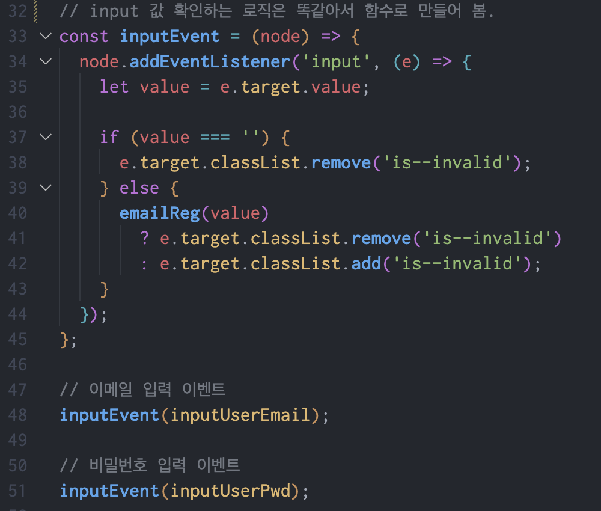
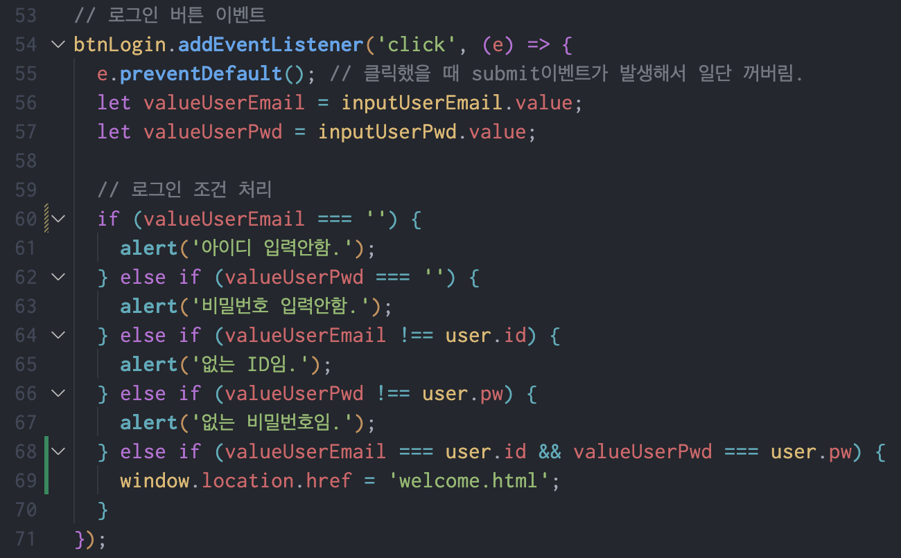
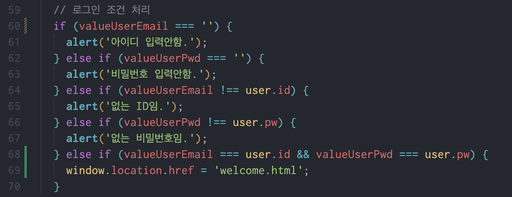

# 네이버 로그인 페이지 구현

---

로그인과 비밀번호를 정확히 입력했을 때 welcome 페이지로 넘어갈 수 있도록 코드 로직을 작성합니다.

---

- [x] 재사용 가능한 함수를 분리하고 함수를 중심으로 설계하는 방법에 대해 학습합니다.

## 과제 설명

### 기능 요구사항

1. email 정규표현식을 사용한 validation
2. pw 정규표현식을 사용한 validation
3. 상태 변수 관리
4. 로그인 버튼을 클릭시 조건처리

## 요구사항 구현 및 기능 구현

- email, pw 입력 이벤트 처리, 상태 변수 관리

  > - node를 파라미터로 받아서 이벤트를 처리하는 함수를 만들어서 재사용성을 높였습니다.
  > - `e.target.value`를 사용해서 input에 입력된 값을 `let value`에 할당합니다.
  > - `value`가 빈문자열일 경우, `e.target`에 classList를 사용해서 `is--invalid`를 추가하고, 아닐 경우 제거합니다.
  >   

- 로그인 버튼을 클릭시 조건처리, 상태 변수 관상

  > - `e.preventDefault()`를 사용해서 submit 이벤트를 막습니다.
  > - `valueUserEmail`과 `valueUserPwd`에 `input`에 입력된 값을 할당합니다.
  >   

- 정규표현식을 사용한 validation

  > 
